## Part 1: Edge Detection in Grayscale Images

**1.** For edge detection in grayscale images, preparation of the images was required. Specifically, white Gaussian noise was added to the image $I_o = \text{"edgetest 26.png"}$ after it was read. Given that the goal was to create two images, one with $PSNR=10$ and the other with $PSNR=20$, two noise signals were created and added to the original image with a standard deviation calculated based on the following formulas:

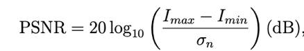

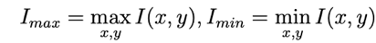 

Increasing the noise reduces the PSNR as shown in Figure 1.

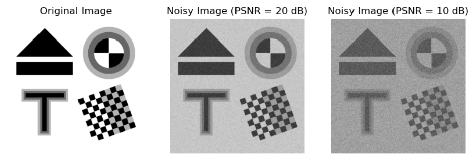

<em>Figure 1: Input images.</em>

**2.** To implement the detection algorithm, several functions were created. Initially, a linear filter with a two-dimensional Gaussian impulse response was created, which smoothed the image. More specifically, the kernel of the Gaussian filter was implemented by the outer product of a one-dimensional Gaussian kernel of size $n \times n$ pixels with $n = \lceil 3 \cdot \sigma \rceil \cdot 2 + 1$. Then, a linear filter was implemented with a Laplacian-of-Gaussian (LoG) impulse response, which detects the edges of the image. The kernel of this filter had a size of $n \times n$ pixels with $n = \lceil 3 \cdot \sigma \rceil \cdot 2 + 1$ and was realized based on the following formula:

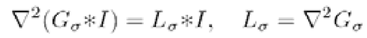

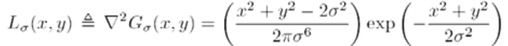

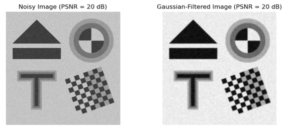
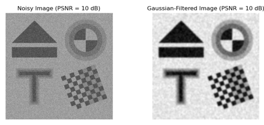

<em>Figure 2: Gaussian filter results for the two images.</em>

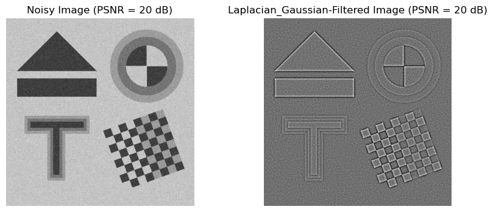
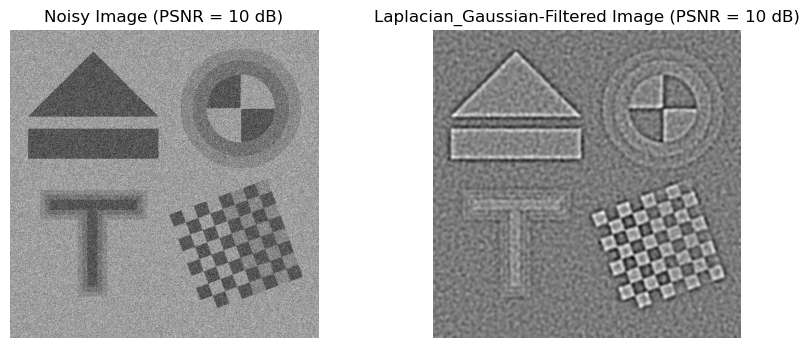

<em>Figure 2: LoG filter results for the two images.</em>

### Observations

The Gaussian filter blurs the image while the LoG filter detects areas with abrupt brightness changes.

**Note:** The LoG filter was implemented in two ways: the one mentioned above and by applying a Laplacian operator to the Gaussian kernel. The second implementation was not chosen because three filters were applied, which added approximation errors, so the final result presented a large error.

Subsequently, the Laplacian $L$ was performed in a linear ($L_1$) and non-linear ($L_2$) manner. In the linear approach, the image $I$ was convolved with the above LoG filter:

$$L_1 = \nabla^2(G_\sigma * I) = (\nabla^2 G_\sigma) * I = h * I$$

More specifically, the first method is more sensitive to noise but has low computational complexity since you apply a Gaussian filter and then two derivative filters. In the non-linear approach, morphological filters were used on the smoothed image $I_\sigma$ based on the formula:

$$L_2 = (I_\sigma \oplus B) + (I_\sigma \ominus B) - 2I_\sigma$$

where $I_\sigma$ is the convolution of the original image with the above Gaussian filter: $I_\sigma(x, y) = G_\sigma * I(x, y)$ and $B$ is a kernel as it appears in Figure 3. The second method is more robust to noise but has high computational complexity. Its operation is based on detecting areas of large brightness change by adding the increased bright areas resulting from dilation and the decreased brightness areas resulting from erosion. Finally, subtracting $-2I_\sigma$ ensures that the Laplacian is zero in smooth areas and enhanced near areas of large curvature.

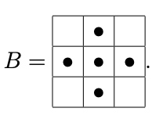

<em>Figure 3: Kernel B of the morphological filters.</em>

To locate the zero-crossing points of $L$, the `zerocrossings` function was used. This function first converts the images into binary by setting the values where $L$ is greater than $1$ to $1$ and the others to $0$. Then it finds the contours of the image with the formula $Y = (X \oplus B) - (X \ominus B)$ and keeps the values for which $Y[i, j] = 1$ and

$$||\nabla I_\sigma[i, j]|| > \theta_{\text{edge}} \cdot \max_{x,y}||\nabla I_\sigma||$$

where $\theta_{\text{edge}}$ is a threshold parameter.

Based on the above, the `EdgeDetect` function was created, which accepted as an argument an image, the standard deviation of the Gaussian filter, the threshold $\theta_{\text{edge}}$, and the method of calculating the Laplacian $L$ (linear or non-linear). This function applied the linear or non-linear filter depending on the argument and then the zero-crossing function, and returned as output a binary edge image $D$, with a value of $1$ only at the points selected as edges.

**3.** For the evaluation of the model, the edges $T$ of the original image $I_o$ were first found based on the relations $M = (I_o \oplus B) - (I_o \ominus B)$ and $T = M > \theta_{\text{realedge}}$. Based on these edges, the quality evaluation criterion $C = [\Pr(D|T) + \Pr(T|D)] / 2$ was created, where $\Pr(D|T)$ is the percentage of edges that were detected and are true (Precision) and $\Pr(T|D)$ is the percentage of true edges that were detected (Recall).

Different input parameters were tested for the images with noise ($PSNR=10, 20$) and the best parameters were found:

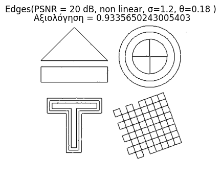
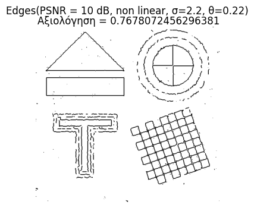

<em>Figure 4: Outputs of the EdgeDetect function for the best parameters.</em>

### Observations

The edges in the image with the least noise are detected better. Also, the non-linear method gives better results, which agrees with the theory.

Different inputs were tested:

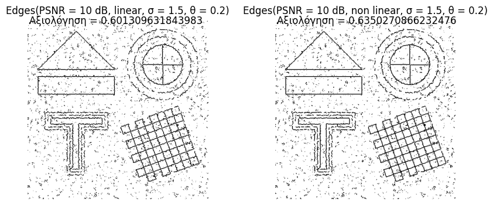
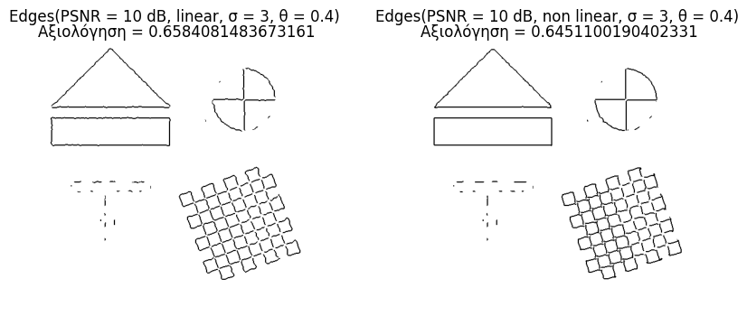
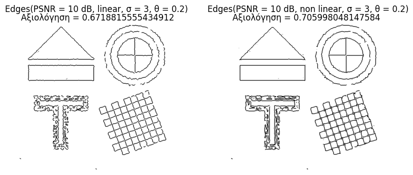
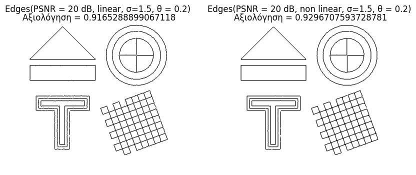

<em>Figure 5: Outputs of the EdgeDetect function.</em>

### Observations

The quality of the output depends largely on the parameters of the `EdgeDetect` function. The non-linear method generally shows better performance, as it is more robust to noise, except in the case where the threshold $\theta_{\text{edge}}$ takes very large values, in which case important edges are rejected. In contrast, the linear method is more sensitive to implementation, as the derivative filters amplify the image noise and even small fluctuations can lead to false edge detections. The parameter $\sigma$ determines the degree of smoothing of the image, resulting in fine details being preserved for small values, but detection is more affected by noise, while for large values, details are lost but edges are detected more clearly. In other words, there is a trade-off between detail detection and noise robustness. At the same time, the parameter $\theta_{\text{edge}}$ determines which of the detected edges are considered real and which are due to noise, since small values of $\theta_{\text{edge}}$ lead to the detection of more edges and the preservation of details but with a greater presence of noise, while large values lead to more reliable edges but with the risk of losing real low-intensity edges. Overall, the parameters $\sigma$ and $\theta_{\text{edge}}$ interact and must be adjusted together to achieve the optimal balance between sensitivity and reliability in edge detection.

**4.** The algorithm was tested on the real image ermoupoli.jpg.

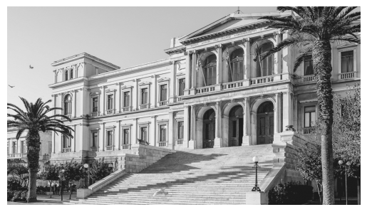

<em>Figure 6: The image view.</em>

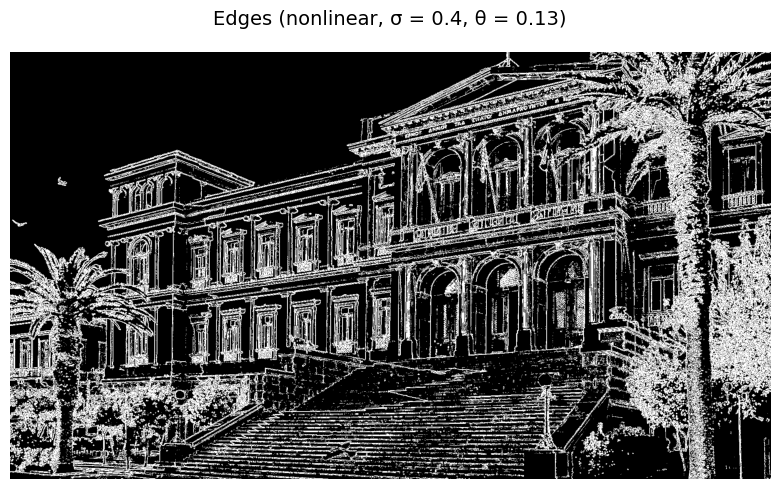

<em>Figure 7: Outputs of the EdgeDetect function for the best parameters.</em>

### Observations

The given image has many details and little noise. For this reason, small values were chosen for $\sigma$ and $\theta_{\text{edge}}$.

Initially, various values for $\sigma$ were tested:

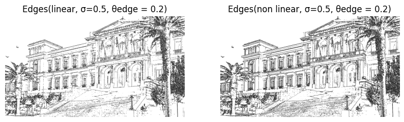
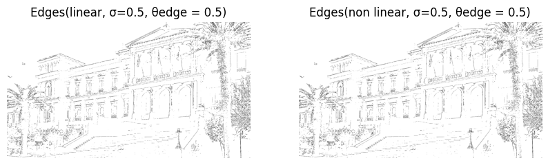
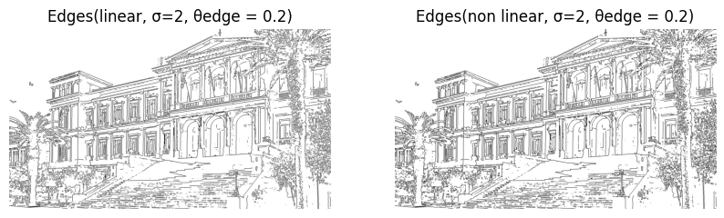
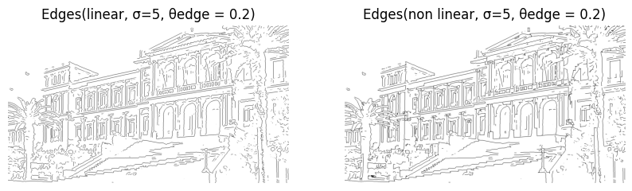
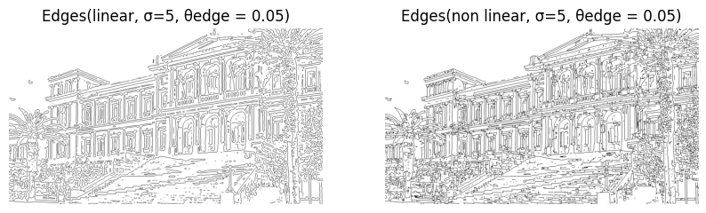

<em>Figure 8: Outputs of the EdgeDetect function for various σ.</em>

### Observations

The results agree with the theory. Specifically, for small values of the parameter $\sigma$, many details are detected, while as $\sigma$ increases, mainly the most important edges are detected (example: 1st image compared to the 4th). Furthermore, as the threshold $\theta_{\text{corn}}$ increases, more edges are detected (1st image compared to the 2nd). The interaction of the two parameters is also evident, as when $\sigma$ is small and $\theta_{\text{corn}}$ is large, detail is preserved without much noise appearing, while when $\sigma$ is large and $\theta_{\text{corn}}$ is small, edges appear less detailed, but the basic and important information of the image is preserved (1st image compared to the 5th). Overall, it is important to choose a balance between the parameters $\sigma$ and $\theta_{\text{corn}}$ so that details are detected without the appearance of false edges due to noise.

---

## Part 2: Interest Point Detection

For the second part, the images "solar.jpg" and "blood_cells.jpg" were required, which had to be converted to RGB and GRAYSCALE.

**2.1)** The `CornerDetect` function was implemented for corner detection using the Harris-Stephens method.

This method is based on modeling the brightness change in an area around each pixel. Formula $(3)$ shows the brightness change around a pixel and is simplified by using the Structure tensor matrix $M$ $(4)$, which shows how features change in an area around each pixel of an image.

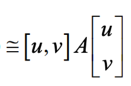

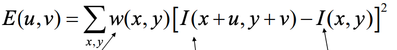 

*window brightness change of neighboring pixels*

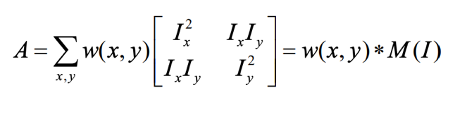 

The eigenvalues of the Structure tensor matrix $M$ show the direction of greatest and smallest change. For an edge to exist, a large change in two directions is needed. In this way, edges in an image were detected.

First, the Structure tensor matrix $M$ $(4)$ was created and Gaussian filtering was applied as in formula $(5)$.

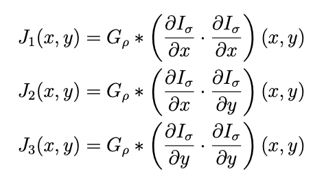 

Then the eigenvalues of matrix $M$ were found based on formula $(6)$ and the cornerness criterion was calculated $(7)$.

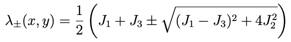

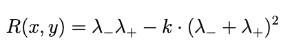 

Points that fulfilled the following conditions were selected as corners:

1. They constituted a maximum within a window and
2. They have a value $R(x,y)$ greater than a percentage of the maximum: $R(x,y) > \theta_{\text{corn}} \cdot R_{\max}$

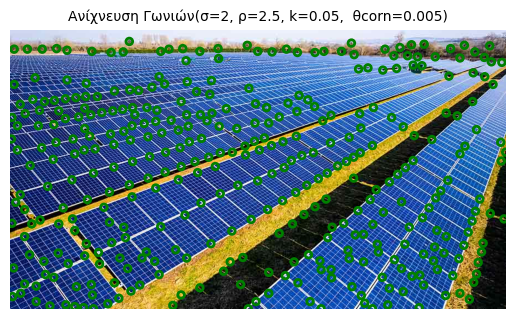

<em>Figure 9: Output of the CornerDetect function.</em>

### Observations

The corner detection function uses the classic Harris-Stephens method and detects the corners of the image with a good degree of accuracy. The parameters significantly affect the results: $\sigma$ and $\rho$ control the Gaussian filtering and the size of the area being examined, resulting in the image being smoothed more or less and the detection being more or less local. The factor $k$ determines how strict the criterion is for a point to be considered a corner, with smaller values detecting more corners but also more false points, while larger values give fewer but more stable corners. The parameter $\theta_{\text{corn}}$ determines which of the detected corners are considered real and which are likely due to noise. Finally, corner detection is more effective when edge detection precedes it, as the areas of interest are limited to points with a sharp change in intensity, reducing false points and improving the accuracy of the results.

**2.2)** The `MultiscaleCornerDetect` function was implemented for multiscale corner detection using the Harris-Laplacian method. In this way, points of interest are detected at multiple scales, as different corners are detected at different scales. Initially, the scale-space for integration and differentiation was created based on formula $(8)$.

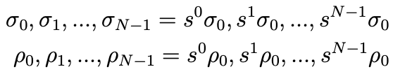 

Subsequently, corners were detected based on the `CornerDetect` function for each scale. To select the scale for each point, the scale-normalized Laplacian of Gaussian (LoG) $(9)$ was used. The LoG allows analysis at the scale level in addition to position. More specifically, after finding the corners at different scales, the corners that show local maxima with respect to scale are selected.

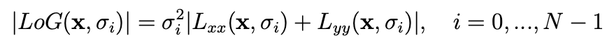 

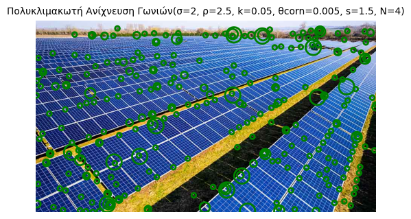

<em>Figure 10: Outputs of the MultiscaleCornerDetect function.</em>

### Observations

The multiscale corner detection function detects the corners of the image with high accuracy, utilizing information from different levels of resolution. Its logic is based on the fact that each scale examines the image at a different level of detail: at smaller scales, the finest and smallest corners are detected, while at larger scales, the most intense and large corners are detected. The parameters $\sigma$, $\rho$, $k$, and $\theta_{\text{corn}}$ affect the performance of the function, determining the sensitivity to corner detection and the restriction of noise, just like in the corresponding `CornerDetect` function. The parameter $s$ determines the scale increment step at each level, affecting the resolution in the scale space. A small $s$ allows the exact location of the ideal scale for each corner, while a large $s$ speeds up the process but may skip important features. The number of levels $N$ defines the depth of the search, with larger values offering scale invariance, allowing the detector to spot corners corresponding to both small details and large geometric structures that would not be visible at a single scale. The multiscale approach thus allows the recognition of corners of multiple scales with greater reliability.

**2.3)** The `BlobDetect` function was implemented, which detects blobs defined as areas with some homogeneity that differ significantly from their neighborhood. Initially, the Hessian matrix $(10)$ was created, which describes the local curvature of a multivariable function.

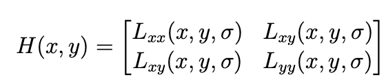 

The criterion:

$$R(x, y) = \det(H(x, y)) = L_{xx}(x, y, \sigma) L_{yy}(x, y, \sigma) - L_{xy}(x, y, \sigma)^2$$

was constructed, and the points that fulfilled the following conditions were selected as blobs:

1. They constituted a maximum within a window and
2. They have a value $R(x,y)$ greater than a percentage of the maximum: $R(x,y) > \theta_{\text{corn}} \cdot R_{\max}$

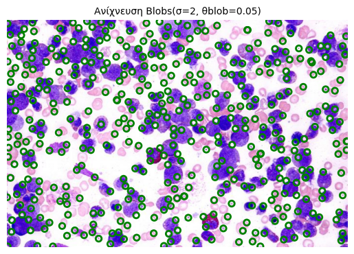

<em>Figure 11: Outputs of the BlobDetect function.</em>

### Observations

The `BlobDetect` function is used to detect areas of homogeneity in images, with moderate accuracy. The implementation using the Hessian adds significant noise, as the second derivatives are calculated via two approximation filters, which are not exact. It is also observed that the parameter $\sigma$ significantly affects both the size and the clarity of the detected blobs. Specifically, small values of $\sigma$ lead to the detection of fine and small blobs but increase sensitivity to noise. Conversely, larger values of $\sigma$ prefer larger and smoother areas, reducing the number of false detections. In addition, the choice of the threshold $\theta_{\text{corn}}$ is crucial for the quality of the results. Small threshold values lead to the detection of more blobs, including weak or noisy areas, while large values limit detection only to the most intense and reliable areas.

**2.4)** The `MultiscaleBlobDetect` function was implemented for multiscale blob detection with the Hessian-Laplace method. As with `MultiscaleCornerDetect`, the scale-space for integration and differentiation was initially created based on formula $(8)$. Subsequently, blobs were detected based on the `BlobDetect` function for each scale. To select the scale for each point, the scale-normalized Laplacian of Gaussian (LoG) $(9)$ was used. More specifically, the points that maximized the LoG in a neighborhood of two consecutive scales were selected.

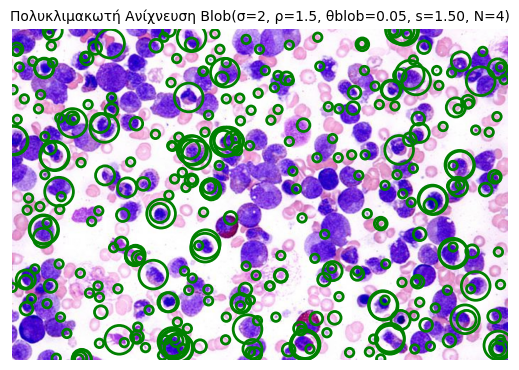

<em>Figure 12: Outputs of the MultiscaleBlobDetect function.</em>

### Observations

The `MultiscaleBlobDetect` function extends blob detection to multiple resolution levels, although with moderate accuracy due to the errors it inherits from the basic `BlobDetect` function. The image is analyzed at different scale levels, allowing the detection of blobs of varying size and detail level. The parameters $\sigma$ and $\theta_{\text{corn}}$ affect the performance of the function in the same way as in `BlobDetect`, determining the sensitivity in detection and the resistance to noise. The parameters $s$ and $N$ determine the behavior at the scale level, in the same way they affect `MultiscaleCornerDetect`, controlling the step of scale increase and the number of levels of the pyramid, and consequently the accuracy and scale invariance of the detection.

# Part 3: Image Classification using Local Descriptors and Deep Neural Network Feature Extraction Techniques

##  Introduction

Object Detection and Image Classification require precise "translation" of raw pixel data into discrete categorical labels. This part contains the analysis of two discrete classification methods, applied to a dataset from TU Graz. Specifically, the dataset contains 3 categories of images: cars, persons and bikes. The initial methodology utilizes a Bag-of-Visual-Words (BoVW) model, which uses Local Descriptors. The secondary methodology employs Deep Learning techniques, using Feature Extraction, through a pre-trained MobileNetV3-Small Convolutional Neural Network (CNN). This implementation investigates the subtraction of the final classification layer of a CNN and the mapping of the high dimensional feature vectors (extracted from the pooling layer) into a Support Vector Machine (SVM) for supervised classification.

# 3.1 Local Descriptor Classification

The Interest Points of an Image, allow us to obtain a region estimation, which contains significant structural characteristics of the image. In order to facilitate the classification of these complex data structures, it is necessary to properly encode the visual information of the local neighborhood, that surrounds each point. The radius of each such neighborhood depends on scale. From these neighborhoods, we extract Local Descriptors.

We will be using these two specific Local Descriptors:

-  SURF (Speed Up Robust Features)
-  HOG (Histogram of Oriented Gradients)

Both of these Local Descriptors receive the local neighborhood of an Interest Point as input and encode the information of subparts of that neighborhood, utilizing the first-order directional derivatives. However, the SURF method first computes the dominant orientation of the neighborhood, in order to ensure the extraction of rotation-invariant descriptors.

#### Histogram of Oriented Gradients (HOG)

The HOG descriptor manages to highlight edge information, by assessing the local shape and structural characteristics of objects. The descriptor follows this mathematical pipeline:

1. **Gradient Computation:** We perform a convolution of the image, using central difference kernels (e.g., $h_x = [-1, 0, 1]$ and $h_y = [-1, 0, 1]^T$), in our effort to calculate the directional derivatives $I_x$ and $I_y$. Subsequently, the gradient magnitude $m(x,y)$ and orientation $\theta(x,y)$ are calculated, for each pixel:
    
    $$m(x,y) = \sqrt{I_x^2(x,y) + I_y^2(x,y)}$$
    
    $$\theta(x,y) = \arctan \left( \frac{I_y(x,y)}{I_x(x,y)} \right)$$

2. **Spatial Partitioning and Histogram Generation:** The neighborhood of the interest point is partitioned into small spatial units, for the extraction of Local Descriptors. These units are called **cells**. For each cell, we extract a histogram that encodes the distribution of its edges, per pre-defined orientation range ($[0^\circ, 180^\circ]$). Each pixel within a cell "votes" for an orientation bin. Though, the vote "intensity" is weighted by the gradient magnitude $m(x,y)$.

3. **Normalization**: Histograms from groups of adjacent cells (blocks) are normalized, in order to adjust their behavior for every possible variation in illumination. Typically, this procedure is achieved using the L1, or L2 norm. 

The final descriptor is composed from the concatenation of these blocks of histograms, that span the entire neighborhood.

#### Speeded-Up Robust Features

Following the same logic as HOG, the local descriptors for each interest point are derived from the following steps:

1. **Computation of directional derivatives** using Haar wavelets (similar logic to difference operators, implemented using integral images corresponding to the Fast-Hessian detection stage).
    
2. **Computation of the orientation** for a region around the point to extract rotation-invariant descriptors.
    
3. **Calculation of a 64-dimensional feature vector** for a square window with a size dependent on the scale and the orientation computed previously.

## 3.1.1

Initially, we extract the features of the images from the given TU-Graz dataset, using the FeatureExtraction function. This function takes as input a Local Descriptor function (we use solely multi-scale versions) and an interest point extraction function. 

Since there is a mismatch between the inputs generally required by the detector functions and the detector functions as they are utilized within the structure of the FeatureExtraction function, anonymous (`lambda`) functions are employed. 

This computational pipeline, investigates 4 different combinations:

- **Harris-Laplace + SURF:** Combines corner-centric multi-scale detection with Haar wavelet-based encoding.
    
- **Harris-Laplace + HOG:** Combines corner-centric multi-scale detection with gradient distribution encoding.
    
- **Hessian-Laplace + SURF:** Combines blob-centric multi-scale detection with Haar wavelet-based encoding.
    
- **Hessian-Laplace + HOG:** Combines blob-centric multi-scale detection with gradient distribution encoding.

We utilize the FeatureExtraction function, which converts the images to grayscale and resizes them to 50% of their original dimensions, using area-based interpolation, in order to reduce computational overload, while also minimizing aliasing and noise. Subsequently, the function applies the detector, descriptor combination to the data and returns a nested array structure, which maps the extracted local descriptors to their source image and class index.

## 3.1.2

In this phase the data is organized for the machine learning pipeline, following the extraction of the local features from the entire dataset. Specifically, the dataset is partitioned into a training set and a testing set. Moreover, ground-truth labels must be created, in order to associate each image's feature set with its proper, respective target class.

In order to achieve this, the given createTrainTest function is utilized. This function accepts the previously extracted feature set, as input. It splits the data and generates the corresponding numerical labels. This happens so that the classifier can be trained on a representative subset of the data. Following this, the classifier is evaluated on not-previously-assessed data, in order to accurately measure its predictive robustness. To ensure experimental reproducibility, the dataset partitioning is not random. Rather, the function utilizes predefined fold indices, loaded from the `Fold_Indices.mat` file.

## 3.1.3

Instead of directly leveraging the Local Descriptors that we extracted earlier, for each image, we will follow a different approach: We will generate Histograms that visualize the frequency of appearance of certain optical patterns, that are extracted from a set of Local Descriptors. This is the founding principle of the Bag of Visual Words (BoVW) model. Specifically, since the intention is to train a classifier (like the SVM), the circumstances necessitate a single, global feature vector of fixed dimensionality, for every sample. Therefore, the BoVW model transforms the local descriptors into frequency histograms of their occurrences across the image. 

The construction of the BoVW representation is implemented via the given `BagOfWords` function. The structure of the function is comprehensively explained in the following steps:

1. **Creation of the Visual Vocabulary:** 
     The k-means clustering algorithm is applied to the entire set of local descriptors, which constitutes the training set. This results in the creation of cluster centroids, which serve as the visual words, of the Visual Vocabulary.
     
 2. **Quantization and Histogram Creation:**
		Every individual image sample has its local descriptors compared against all the visual words (cluster centroids) in the visual vocabulary. This happens regardless of whether the image sample is part of the training/test set. Each descriptor is, then, assigned to the nearest cluster centroid, as unveiled by their euclidian distance. This mapping allows for the creation of a frequency histogram for each image, displaying the number of occurrences of each visual word.
	    
3. **Normalization:**
		Each image will probably contain a different number of interest points, which leads to a different sum of frequencies in the respective histogram of each image. For that reason, the final histogram of each image is normalized (with its L2 norm), ensuring that the feature vectors are directly comparable with one another. This compensates for the effect of variations in the initial quantity of local descriptors, in each image.

## 3.1.4

This concluding stage of the pipeline revolves around the final classification of the images, using a multi-class Support Vector Machine (SVM), as well as the evaluation of the aforementioned classification. For the categorization process, the SVM will utilize the BoVW representation of the images. Specifically, the SVM maps the normalized histograms into a high-dimensional space and determines the optimal decision boundaries (hyperplanes) that properly separate the 3 distinct object categories: ("person", "car", "bicycle").

The execution of this process takes place using the provided `svm` function. This function trains a model using the training set histograms and evaluates it on the test set, returning the predicted class labels, as well as the overall recognition accuracy score.

**Experimental Evaluation**

Four descriptor-detector combinations were evaluated, as seen below:

1. **Harris-Laplace + SURF:** Achieved an accuracy of [69.655]%.
    
2. **Harris-Laplace + HOG:** Achieved an accuracy of [59.172]%.
    
3. **Hessian-Laplace + SURF:** Achieved an accuracy of [72.414]%.
    
4. **Hessian-Laplace + HOG:** Achieved an accuracy of [60.000]%.

This experimental evaluation clearly displays the SURF algorithm's superiority over HOG, as it outperforms it by 10-12%. This indicates that that the SURF's approach, which encodes information using Haar wavelets is more robust to variations across classes. In contrast, HOG, which partitions the image into a homogenous, orthogonal grid of cells, forces a fixed geometric constraint on the distribution of gradients. This may be the reason it underperforms, likely due to its hyper-sensitivity to deformations and structural diversity in the 3 categories ("person", "bike", "cars").

Concurrently, there is a slight performance increase, when comparing the multi-scale detectors with one another. Specifically, there is a performance increase when employing the Hessian-Laplace detector (+1% to +3%). This variance is attributed to the manner in which both algorithms localize interest points. One the one hand, Harris-Laplace constitutes a corner-centric detector, whereas Hessian-Laplace constitutes a blob identifier. The target objects of the provided dataset (e.g cars and people) are mainly defined by blob-looking features, regardless of their size. Consequently, the Hessian detector extracts a more accurate set of reference points/spatial features, for this specific dataset.

Ultimately, the overall most appropriate pipeline for image categorization of the given dataset, is the Hessian-Laplace + SURF pipeline, having achieved the highest accuracy score (72.414%). This combination optimally localizes blob-looking structures and accurately encodes them, resulting in a visual vocabulary that enhances the SVM's predictive performance.

----

# 3.2 Classification using Convolutional Neural Networks Features

The previous section's approach relied on traditional local descriptors, specifically HOG and SURF, in conjunction with the BoVW technique. In this section, Convolutional Neural Networks (CNNs) are utilized, which have gained significant attraction in modern Computer Vision problems.

### Transfer Learning

Training a CNN from scratch can be immensely costly in both data and computational resources. For this exact reason, we adopt a technique called Transfer Learning. In this technique, a network that is pre-trained on a large scale dataset (like ImageNet) has already "figured out" how to extract layered visual abstractions. Thus, instead of training a CNN from the beginning, we utilize the pre-trained model's feature extraction capabilities. This is achieved, by removing one or more layers from the final classification layers (also denoted as the classification head) and by feeding our own images into the network. Consequently, the deep features (activation) are stored in a descriptor vector. This vector can, then, be fed into a traditional classifier (like a SVM) or on another neural network layer.

In order to implement this architecture, we employed the MobileNetV3-Small model, which extracts features from the Pascal VOC2005 database. MobileNetV3-Small is a computationally lightweight model, specifically designed for usage in resource-limited environments. It consists of 15 layers, while a final layer trained on classifying input images into 1 out of 1000 ImageNet categories.

## 3.2.1

In order to properly integrate Transfer Learning, it is essential to carefully reproduce the preprocessing conditions, under which the model is originally trained. The MobileNetV3-Small network was originally trained on the ImageNet dataset, which puts in place strict rules, with regards to how visual data is processed, prior to being fed into its neurons. 

1. **Model and Weights Loading:** The `torchvision.models` library contains both the model and its pre-trained weights. Additionally, the named_modules() method enables the inspection of the internal architecture of the model. This method allows for the direct identification of the classification layers that ought to be removed in the subsequent steps.

2. **Normalization and Transforms:** The `weights.transforms()` method extracts the preprocessing pipeline that was used for ImageNet. This includes the resizing of the image, the application of center cropping, the conversion into a PyTorch Tensor and finally, the normalization of it, using the mean and variance of the original dataset.

3. **Color Channel Order:** The pre-trained models of PyTorch explicitly expect an RGB color space. The `Pillow` Library which was used, reads the data in RGB by default, avoiding color incompatibility errors. 

# 3.2.2

The default architecture of the MobileNetV3-Small network terminates in a classification layer, whose role is to categorize the images into 1000 distinct classes. This creates a corresponding 1000-dimensional vector. In order to utilize the model solely as a feature extractor, it is essential that we both remove the classifier head and that we retain the output of the preceding section of the network.

The isolation of the layer that precedes the classifier head is implemented through the `create_feature_extractor` function, from the `torchvision.models.feature_extraction` library. This function enables the reconstruction of the network and the extraction of the activations from the desired layers. The extraction node used is the `avgpool` (Global Average Pooling) layer. This ensures the "wrapping" of the multi-dimensional feature maps of the previous layers into a one-dimensional vector. This resulting dense vector provides a general summary of the image content and is thus, compatible with the input requirements that a standard classifier imposes.

In order to properly facilitate the feature extraction procedure, the optimization of computational resources and the reproducibility of the forthcoming results, it is necessary to set the model to evaluation mode and to deactivate gradient computations. Specifically, the command `model.eval()` is utilized in order to transition the model into evaluation mode. This configuration provides stable behavior from the layers (such as from the Batch Normalization and Dropout Layers), preventing, in that manner, the introduction of randomness, into the to-be-generated results. Concurrently, the deactivation of the computation of gradients is executed via the  `torch.no_grad()` configuration wrapper. Given that the weights of the pre-trained network remain static, the computation of gradients is deemed unnecessary. The deactivation of this function also significantly reduces the required memory of the overall feature characterization.

# 3.2.3

Reiterating the dataset partitioning methodology that was used in Section 3.1.2, the dataset is once more, divided into training and testing subsets. In this section though, a different approach is used: rather than relying on the BoVW method, the SVM is trained on the high-dimensional feature vectors extracted from the MobileNetV3-Small network. Further, the evaluation protocol remains identical with the one of Section 3.1.2, optimized now for the SVM classifier: the SVM is evaluated on a not-seen-before testing set, in order to calculate the accuracy of its classification capability. The dataset is again partitioned using the pre-defined folds of `Fold_Indices.mat`. 

### Results

The application of deep convolutional features asserted a very robust classification accuracy of 96%. It is evident that the transition from visual vocabularies (BoVW) into high-dimensional feature vectors resulted in a significant increase in the classification accuracy, highlighting the advantages of using a pre-trained CNN for feature extraction. 

MobileNetV3 provides a very comprehensive representation of the image, whereas the BoVW pipeline focuses on gradient transitions, which allows it to lose spatial context. Flattening the final pooling layer of the CNN into a 576-dimensional vector enables the projection of the images into a space with clearly defined decision zones. Thus, class separation becomes an easier task for the SVM.

# 3.2.4

In order to investigate the learning process of the MobileNetV3-Small architecture, the internal featuer maps were extracted and visualized, utilizing the `create_feature_extractor` function form TorchVision. Specifically, intermediate activation outputs from layers 1, 3, 6, 12 were visualized. An example image from all three target classes was used for this visualization. For dimensionality reduction and data compression purposes, only channels 0, 1, 2 of the output tensor were visualized.

These are the outputs for the three images we inserted, one for each category:

![[Screenshot 2026-03-29 at 15.02.08.png]]

![[Screenshot 2026-03-29 at 15.02.24.png]]

![[Screenshot 2026-03-29 at 15.02.37.png]]

The generated visual grids demonstrate the CNN's ability to convert raw pixels into abstract "conceptual" encodings. 

- **Shallow Layers :** In these initial stages, the network's image resolution remains relatively high. The filters act as low-level feature extractors and silhouette identifiers, identifying patterns. For instance, in the car image, these early channels highlight the human silhouette and the visual boundaries (optical edges) of a human.

- **Intermediate Layers :** Moving towards the deeper layers, the downsampling of the data becomes all the more evident. There is significantly decreased spatial resolution and the features become more abstract. Features that do not match the desired, by the network, patterns get "attenuated", meaning that the mathematical activation function zero's them out, making room for the desired feature silhouettes. 

- **Deep Layers :** Here, the dimensions are heavily compressed into a very low resolution grid, were individual pixels are clearly visible. All visual coherence to the human eye is lost. However, the network has decided whether or not the desired pattern exists and has clearly attenuated the undesired patterns, or rather amplified the patterns it seeks to retrieve. This abstracted data is then flattened into a 576 point vector, that ultimately feeds the provided SVM.

# 3.2.5

In order to evaluate the robustness of the extracted features, the classification pipeline was tested against two types of image distortion: Gaussian Noise (mean=0, std=25) and Spatial Rotation (Random angle between -45 and +45 degrees). Both the BoVW and the CNN-SVM pipeline were re-evaluated, under these conditions, using 5-fold cross-validation. 

#### Summary of Results

| **Architecture / Feature Combination** | **Gaussian Noise Accuracy** | **Rotation [-45°, 45°] Accuracy** |
| -------------------------------------- | --------------------------- | --------------------------------- |
| **Harris-Laplace + SURF**              | 69.65%                      | 59.17%                            |
| **Harris-Laplace + HOG**               | 50.89%                      | 47.72%                            |
| **Hessian-Laplace + SURF**             | 70.62%                      | 62.06%                            |
| **Hessian-Laplace + HOG**              | 53.24%                      | 51.03%                            |
| **MobileNetV3 (CNN)**                  | **93.10%**                  | **94.90%**                        |

#### Distortion Impact

**1. Gaussian Noise**

Gaussian noise induces random pixel intensity variations. These variations affect the local contrast gradients, on which most detectors rely on.

- **Traditional Descriptors:** The HOG descriptor's accuracy dropped significantly to 50-53%. This though, was expected, as HOG mainly relies on gradient calculations, which gaussian noise severely affects, as mentioned earlier. On the other hand, the SURF descriptor maintained a ~70% accuracy, demonstrating its ability to withstand pixel intensity variations. Moreover, the Hessian-Laplace detector performed slightly better than the Harris-Laplace detector, the most likely reason being that the determinant of the Hessian matrix is more resistant to noise, than the corner measure, used by Harris.

- **CNN:** The CNN demonstrated extreme persistence, keeping a high accuracy of 93.1%. Generally, deep neural networks perform noise filtering in their early pooling layers, which eliminate gaussian noise. In that manner, the characteristics of the image remain unaffected. 

**2. Rotation**

Rotation generally provokes a spatial misalignment of the object, within the image frame.

- **Traditional Descriptors:** Specific combinations suffered significantly. Specifically, HOG averaged ~47-51%. Though, this was expected, as  HOG computes gradient histograms, aligned to the original x, y axes of the image. The rotation causes the gradients to be placed in different histogram bins, significantly altering the estimated visual "signature". On the other hand, SURF over-performed HOG, achieving a better ~59-62% accuracy rate. This can be explained by the fact that SURF assigns a standard orientation to keypoints, prior to them being extracted. This assists, partly, in achieving rotation invariance. However, the extreme rotation levels managed to hinder its overall performance.

- **CNN:** Once again, the CNN maintained a leading 94.4% accuracy. It remains heavily assisted by its global recognition patterns and its spatial filters, which allow it to recognize objects, regardless of their orientation.

#### Conclusion

Ultimately, SURF is significantly more robust to noise than HOG, a difference which can be attributed to the difference in architecture: HOG lacks rotation invariance and is highly sensitive to pixel-level gradient alterations. Meanwhile, the Hessian-Laplace detector provides a slightly better feature detection ability. However, all traditional computational methods are easily outperformed by the CNN (MobileNet V3), which proves to be invariant to both spatial rotation and to the introduction of Gaussian noise.

